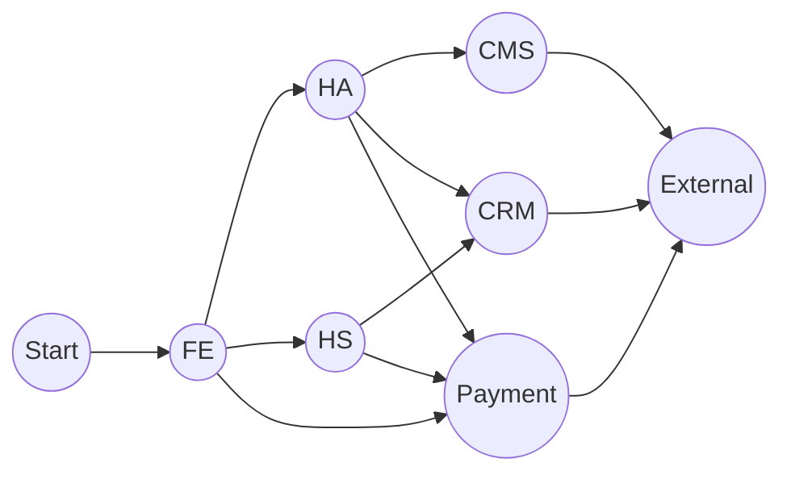

```mermaid
flowchart LR
    Start@{ shape: circle, label: "Start" }
	  FE@{ shape: circle, label: "FE" }
	  HA@{ shape: circle, label: "HA" }
	  HS@{ shape: circle, label: "HS" }
	  CMS@{ shape: circle, label: "CMS" }
	  CRM@{ shape: circle, label: "CRM" }
	  Payment@{ shape: circle, label: "Payment" }
		External@{ shape: circle, label: "External" }
		Start --> FE
		FE --> HA
		FE --> HS
		FE --> Payment
		HA --> CMS
		HA --> CRM
		HA --> Payment
		HS --> CRM
		HS --> Payment
		Payment --> External
        CRM --> External
		CMS --> External
```
